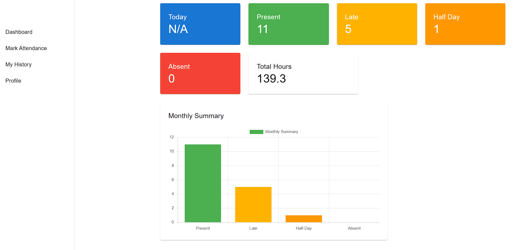
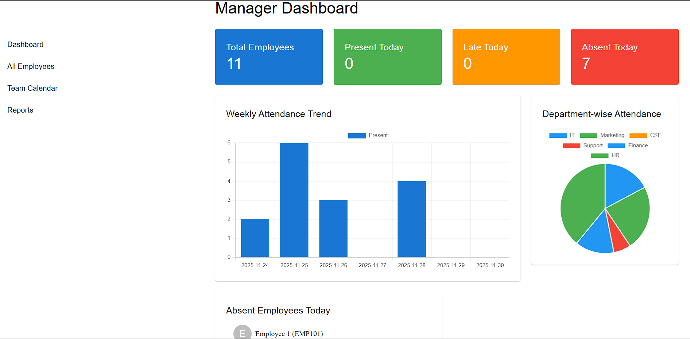
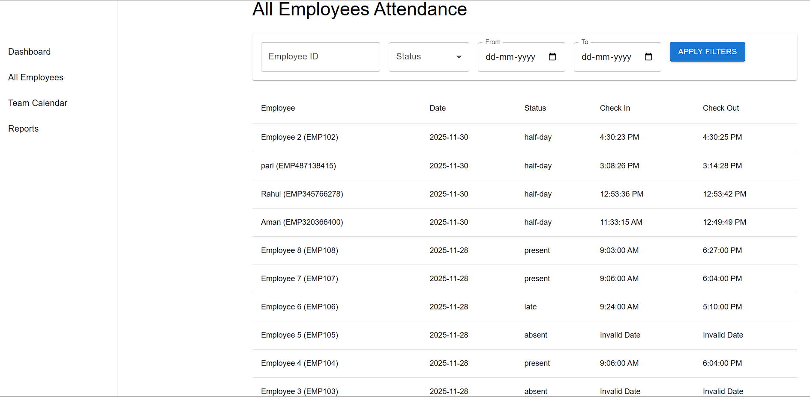
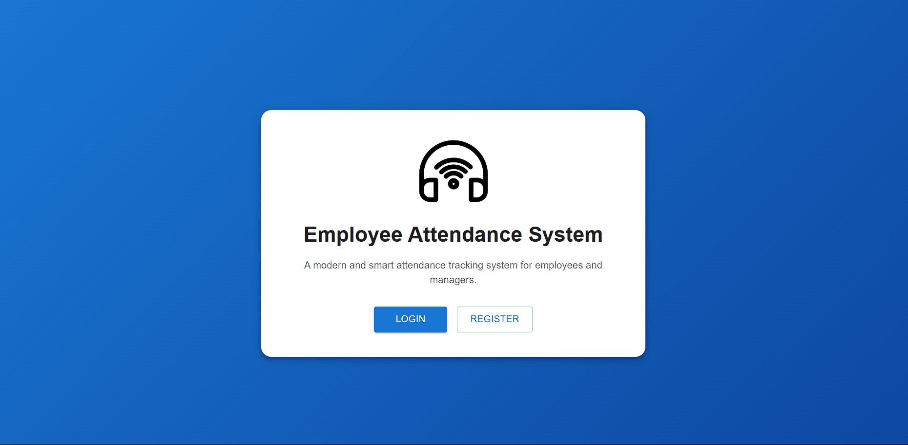

# Employee Attendance System

A full-stack attendance tracking system supporting two roles — **Employee** and **Manager** — built using Node.js, Express, MongoDB, React, and Redux Toolkit.  

---

## Setup Instructions

### **1. Clone the Repository**


### **2. Install Dependencies**

#### Backend

```bash
cd server
npm install
```

#### Frontend

```bash
cd ../client
npm install
```

---

### **3. Configure Environment Variables**

Create a `.env` file in the **backend** folder (refer `.env.example`):

```
PORT=5000
MONGO_URI=your_mongodb_connection_string
JWT_SECRET=your_jwt_secret_key
JWT_EXPIRES_IN=15m
REFRESH_TOKEN_EXPIRES_IN=7d
BCRYPT_SALT_ROUNDS=10
OFFICE_START_TIME=09:30
LATE_GRACE_MINUTES=10
```


Frontend `.env`:

```
VITE_API_URL=http://localhost:5000/api
```

---

## ▶️ How to Run

### **Start Backend**

```bash
cd server
npm run dev
```

Backend runs at: **[http://localhost:5000](http://localhost:5000)**

### **Start Frontend**

```bash
cd client
npm run dev
```

Frontend runs at: **[http://localhost:5173](http://localhost:5173)**

---

## 🔐 Environment Variables

| Variable                   | Description                        |
| -------------------------- | ---------------------------------- |
| `PORT`                     | Backend port                       |
| `MONGO_URI`                | MongoDB connection string          |
| `JWT_SECRET`               | Secret for JWT signing             |
| `JWT_EXPIRES_IN`           | Token validity duration            |
| `VITE_API_URL`             | Frontend base API URL              |


---
## 🔑 Demo Login Credentials

Use the following test accounts to explore the system:

### 🧑‍💼 Manager Account
- **Email:** admin1@example.com  
- **Password:** 123456  

### 👨‍💻 Employee Account
- **Email:** employee2@test.com  
- **Password:** 123456  

> These accounts are for demo/testing purposes only. Please update or remove them in production.

---

## 🖼️ Screenshots


### Employee Dashboard


### Manager Dashboard


### Attendance History


### Home Page



## 📬 Contact Information

If you have any questions, need clarification, or want to discuss improvements, feel free to reach out:

**Name:** Aman Kumar Prasad  
**College:** AU college of engineering<br>
**Contact No:** +91 9704274571  


